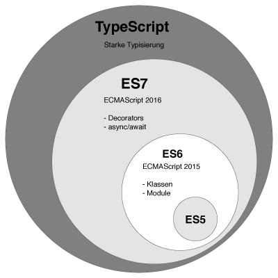

# 第一章 简介

## 第一节 什么是TypeScript

JS是专为浏览器而设计，只是用于处理基本用户交互的语言，JS 本身作为一门动态语言，并没有类型系统，因为它压根就不是为了建造大型应用而设计的。

近几年JS飞速发展，Node.js 的出现使得 JS 不再局限于浏览器中，SPA（单页应用）的流行，使得前端逐渐迈向工程化，项目的代码量急速膨胀。随之而来的问题就是，与 C#、Java 等更成熟的语言不同，JS 并不具备这样的规模化能力。松散的代码、纷乱的类型为项目带来了更多的不可控性和不确定性。为了解决这个问题，大公司们开始寻求解决方案。

 [TypeScript](https://www.tslang.cn/docs/home.html)（简称TS）就是 Microsoft 给出的回答，并且由 C# 之父 Anders Hejlsberg（安德斯·海尔斯伯格） 领衔打造，是微软和Google之间的官方合作项目。

TS扩展了JS的语法，**是 JS的超集**（包含ES6语法），现有的JS代码可与 TS 一起工作无需任何修改，TS可处理已有的 JS代码，并只对其中的 TS代码进行编译。



## 第二节 TypeScript的使用

### 安装

全局安装typescript

```js
//全局安装typescript
npm install -g typescript

//安装后查看版本
tsc -v
```

### 编译

在命令行中输入`tsc test.ts`，将ts文件编译为js文件。

TypeScript只会进行静态检查。


# 第二章 基础类型

| 原有类型  | 说明                                       |
| --------- | ------------------------------------------ |
| string    | 字符串 类型                                |
| number    | 数字 类型                                  |
| boolean   | 布尔 类型                                  |
| object    | 对象 类型（array 和 function是object子类） |
| null      | 空 类型                                    |
| undefined | 未定义 类型                                |

## 第一节 指定类型

只有原始数据类型可以用于声明变量时指定类型，原始数据类型包括：string、number、boolean、null、undefined、symbol共六种，其中，null 和 undefined 是其它类型的子类型，可以赋值给其它类型。

在TS中，每一个变量的类型都是确定的，不同类型的数据之间不能赋值。

### 变量指定类型

```js
//变量 指定类型
const a:string = "Hello world!";
let b:number = 2;
let c:boolean = true;

//null 和 undefined 是其它类型的子类型，可以赋值给其它类型
let num:number=null;
```

### 数组指定类型

```ts
//数组 指定类型（ts规范中，数组中元素类型要保持相同）
let num: number[] = [1, 1, 2, 3, 5];

//可以用any为数组中的元素分配任何类型（不建议）
let list: any[] = ['hxsd', 2004, { website: 'http://hxsd.com' }];
```

## 第二节 新增类型

| 新增类型 | 说明                                             |
| -------- | ------------------------------------------------ |
| tuple    | 元组 类型                                        |
| enum     | 枚举 类型                                        |
| void     | 无 类型 （对函数返回的限定，仅用于无返回值函数） |
| any      | 任意 类型                                        |
| never    | 不存在 类型                                      |

### enum枚举类型

在实际应用中，有的变量只有几种可能取值。例如：人的性别只有两种值，星期只有七种值。

enum枚举类型是一个集合，集合中的元素（枚举成员）是一些 **赋予友好名字的int（整型）常量**。 元素之间用逗号隔开。默认从 `0` 开始为元素赋值，其余成员自动增长。

```ts
enum weekday {sun,mon,tue,wed,thu,fri,sat}；
let today: weekday = weekday.sun;
console.log(today)  //结果：0
```

 也可以手动的指定成员的数值。 例如，将第一个元素改成从 `1` 开始编号，其余自动增长：

```ts
enum weekday {sun=1,mon,tue,wed,thu,fri,sat}
let today: weekday = weekday.tue;
console.log(today)  //结果：3
```

或者，全部都采用手动赋值，可乱序：

```ts
enum weekday {mon=1,tue=2,sun=0,fri=5,wed=3,thu=4,sat=6}
let today: weekday = weekday.sun;
console.log(today)  //结果：0
```

可以由枚举的值得到它的名字。 例如，知道数值为2，但是不确定它的名字：

```ts
enum weekday {mon=1,tue=2,sun=0,fri=5,wed=3,thu=4,sat=6}
let dayName: string = weekday[2];
console.log(dayName);  // 显示'tue'因为上面代码里它的值是2
```

### Any任意值类型

Any任意值类型，用来表示允许赋值为任意类型。变量如果在声明时未指定类型，会被识别为任意类型。

```js
//在声明时未指定类型，会被识别为任意类型
let f:any = 1;  
f = "abc";
```

### Void类型

void类型与any类型相反，它表示没有任何类型。用在没有任何返回值的函数。

>**void与null区别**
>null：表示一个引用类型的变量，这个变量是存在的，但是这个变量暂时还没有指向任何一个值（常用于空对象）。
>void：表示没有任何类型，没有任何值（仅用于无返回值函数）。
>
>**声明一个 `void` 类型的变量没有意义，因为变量只能赋值为 `undefined` 和 `null`**

```ts
function func():void {
    console.log("hxsd");
}
```


## 第四节 联合类型

可以定义为多种类型中的一种，使用 `|` 分隔每个类型，变量在赋值时，会根据类型推论的规则推断出一个类型。

```js
let a: string | number;
a = 'seven';
a = 7;
```


## 第五节 类型推论

没有指定类型的变量默认为any类型的，但是当声明变量时为变量赋了值，则默认变量为该值的类型，这就是类型推论。下面的例子：

```js
let x = 3;
let y;
```

变量`x`的类型被推断为数字。 这种推断发生在：

1. 初始化变量时
2. 设置默认参数值和决定函数返回值时

因此，如果要声明一个任意类型的数据，必须使用 `any`。


## 第六节 类型断言

类型断言（Type Assertion）可以绕过编译器的类型推断，手动指定一个值的类型。

TS在使用联合类型时，当不确定一个联合类型的变量到底是哪个类型的时候，我们只能访问此联合类型的所有类型里共有的属性或方法，默认不能引用不确定类型的方法，使用类型断言即申明此时的属性为某个类型。

类型断言不是类型转换，断言的类型必须是联合类型中的某一个（不能是一个联合类型中不存在的类型）   

```js
function getLength(str: string | number): number {
    return str.length; //报错：Property 'length' does not exist on type 'string | number'
    
    //类型断言:
    //as语法
    return (str as string).length; 
    return (<string>str).length;
}
```


# 第三章 函数

TS对函数的输入（参数值）和输出（return值）进行约束，有效地避免许多低级错误的出现。

## 第一节 定义函数

 JS两种常见的定义函数的方式：

1. 函数声明（Function Declaration）
2. 函数表达式（Function Expression）

### 函数声明

```js
//（参数类型）：返回值类型
function sum(x: number, y: number): void {
    return x + y;
}
```

## 第二节 函数参数

### 可选参数

用 `?` 表示可选的参数：

```js
function buildName(firstName: string, lastName?: string) {
    if (lastName) {
        return firstName + ' ' + lastName;
    } else {
        return firstName;
    }
}
let tomcat = buildName('Tom', 'Cat');
let tom = buildName('Tom');
```


# 第四章 类

TS除了实现了所有 ES6 中的类的功能以外，还添加了一些新的用法。

## 第一节 类的概念

虽然 JS中有类的概念，但是可能大多数 JS程序员并不是非常熟悉类，这里对类相关的概念做一个简单的介绍。

- 类(Class)：定义了一件事物的抽象特点，包含它的属性和方法
- 对象（Object）：类的实例，通过 `new` 生成
- 面向对象（OOP）的三大特性：封装、继承、多态
  - 封装（Encapsulation）：将对数据的操作细节隐藏起来，只暴露对外的接口。外界调用端不需要（也不可能）知道细节，就能通过对外提供的接口来访问该对象，同时也保证了外界无法任意更改对象内部的数据
  - 继承（Inheritance）：子类继承父类，子类除了拥有父类的所有特性外，还有一些更具体的特性
  - 多态（Polymorphism）：由继承而产生了相关的不同的类，对同一个方法可以有不同的响应。比如`Cat` 和 `Dog` 都继承自 `Animal`，但是分别实现了自己的 `eat` 方法。此时针对某一个实例，我们无需了解它是 `Cat` 还是 `Dog`，就可以直接调用 `eat` 方法，程序会自动判断出来应该如何执行 `eat`
- 存取器（getter & setter）：用以改变属性的读取和赋值行为
- 修饰符（Modifiers）：修饰符是一些关键字，用于限定成员或类型的性质。比如 `public` 表示公有属性或方法
- 抽象类（Abstract Class）：抽象类是供其他类继承的基类，抽象类不允许被实例化。抽象类中的抽象方法必须在子类中被实现
- 接口（Interfaces）：不同类之间公有的属性或方法，可以抽象成一个接口。接口可以被类实现（implements）。一个类只能继承自另一个类，但是可以实现多个接口

## 第二节 ES6中类的用法

### 属性和方法

使用 `class` 定义类，使用 `constructor` 定义构造函数。通过 `new` 生成新实例的时候，会自动调用构造函数。

```js
class Animal {
    constructor(name) {
        this.name = name;
    }
    sayHi() {
        return `My name is ${this.name}`;
    }
}

let a = new Animal('Jack');
console.log(a.sayHi()); // My name is Jack
```

### 类的继承

使用 `extends` 关键字实现继承，子类中使用 `super` 关键字来调用父类的构造函数和方法。

```js
class Cat extends Animal {
    constructor(name) {
        super(name); // 调用父类的 constructor(name)
        console.log(this.name);
    }
    sayHi() {
        return 'Meow, ' + super.sayHi() + this.sayGood(); // 调用父类的 sayHi()
    }
}

let c = new Cat('Tom'); // Tom
console.log(c.sayHi()); // Meow, My name is Tom
```

## 第五节 ES7中类的用法

ES2016（ES7） 中有一些关于类的提案，TS也实现了它们，这里做一个简单的介绍。

### 静态属性

ES7 提案中，可以使用 `static` 定义一个静态属性：

```typescript
class Animal {
    age: number;
    static num:number = 42;

    constructor() {
        // ...
    }
    
    function foo() {
	}
}
console.log(Animal.num); // 42
```

## 第六节 TypeScript 中类的用法

### 3p修饰符

TS可以使用三种访问修饰符（Access Modifiers）。

| 访问修饰符（3p） | 修饰对象   | 类外 | 子类 | 本类 |
| ---------------- | ---------- | ---- | ---- | ---- |
| public（默认）   | 属性  方法 | √    | √    | √    |
| protected        | 属性  方法 | ×    | √    | √    |
| private          | 属性  方法 | ×    | ×    | √    |

构造函数也可以被标记成 `protected`。 这意味着这个类不能被实例化。

| 额外修饰符 | 修饰对象   | 说明                                                         |
| ---------- | ---------- | ------------------------------------------------------------ |
| static     | 属性  方法 | 静态：可以不new实例，直接通过 `类::方法`   `类::属性`   的方式调用。<br>静态方法不能调用非静态属性（需先实例化对象 ） |
| readonly   | 属性       | 只读：将属性设置为只读，只读属性必须在声明时或构造函数里被初始化。 |
| abstract   | 类  方法   | 抽象：定义抽象类                                             |

```typescript
class Animal {
    public name; //公共
    protected age；//受保护
    private sex; //私有
    
    public constructor(name,age,sex) {
        this.name = name;
        this.age=age;
        this.sex=sex;
    }
}

class Cat extend Animal{
    show(){
        console.log(this.age);//子类可访问父类protected属性
    }
}

let a = new Animal('Jack');
//name是公共属性，可读取、赋值
console.log(a.name); // Jack
a.name = 'Tom';//可以修改

//属性“age”受保护，只能在类“Animal”及其子类中访问
console.log(a.age)

//属性“sex”为私有属性，只能在类“Animal”中访问。
console.log(a.sex)
```

**注意：TS编译之后的js文件，不支持private语法**

## 第四节 静态方法

使用 `static` 修饰符修饰的方法称为静态方法，它们不需要实例化，而是直接通过类来调用：

```js
class Animal {
    static isAnimal(a) {
        return a instanceof Animal;
    }
}

let a = new Animal('Jack');
Animal.isAnimal(a); // true
a.isAnimal(a); // TypeError: a.isAnimal is not a function
```


## 第七节 抽象类

`abstract` 用于定义抽象类和其中的抽象方法。

- 任何一个类，如果它里面至少有一个方法是抽象的（该方法用abstract修饰，没有函数体），那么这个类就必须被声明为抽象的。

- 被定义为抽象的方法只是声明了其调用方式和所需参数，不能定义其具体的功能实现（没有函数体）。

- 定义为抽象的类不能被实例化。

- 继承一个抽象类的时候，子类必须定义父类中的所有抽象方法；这些方法的访问权限一定要高于或等于父类方法的访问权限 : public > protected > private。此外，方法的调用方式必须匹配，即类型和所需参数的数量必须一致。

```typescript
abstract class Animal {
    public name;
    public constructor(name) {
        this.name = name;
    }
    //抽象方法 
    public abstract sayHi();//只是声明了其调用方式和所需参数(没有函数体)。
}
//子类使用extends继承父类
class Cat extends Animal {
    //实现抽象类中的方法
    public sayHi() {
        console.log(`hi, My name is ${this.name}`);
    }
}

//let an=new Animal("jack"); //错误：抽象类不能实例化
let cat = new Cat('Tom');
cat.sayHi();
```

注意：即使是抽象方法，TS的编译结果中，仍然会存在这个类。


```ts
let method:string

let method: 'GET' | 'POST'
```


```ts
function foo(a:number, b: string):boolean {
}

let bar:(aa:number, bb: string)=>boolean;

bar = foo;
```


```ts
let obj: object;
obj = {id: 7, name: 'KangGe', age: 18}

let obj: {id: number}
obj = {id: 7, name: 'KangGe', age: 18}
```


```ts
wx.request({
    url: 'https://mywebsite.com/api/v1/user/1',
    method: 'GET',
    success: res=>{}
})

interface RequestOptions {url:string, method?:'GET' | 'POST'}
function request(params:RequestOptions):void {
    
}
```


method:string

method: 'GET' | 'POST',


params: object,

block: Block,


# 第五章 接口

TypeScript的核心原则之一是对值所具有的结构进行类型检查，接口的作用就是为这些类型命名和为你的代码或第三方代码定义契约。

**接口定义规则，不定义实现**。TS 中的接口是一个非常灵活的概念，主要有两个功能：

1. 用于对**对象的形状**（Shape）进行描述。

   用来建立某种代码约定，其他开发者在创建对象时必须遵守接口所定义的代码约定。

2. 对类的一部分行为进行抽象

   只定义了对象的方法名称和类型，不提供实现，具体需要由类（class）去实现（implements）。

## 定义接口

```js
//首字母大写
interface Person {
    name: string;
    age: number;
}
//tom的属性只能有“name”和“age”两个，多于或者少于这两个属性，都会报错
let tom: Person = {
    name: 'Tom',
    age: 18
};
```

上面的例子中定义了一个接口 `Person`，接着定义了一个变量 `tom`，它的类型是 `Person`。定义的变量比接口少一些或多一些属性都是不允许的。这样，我们就约束了 `tom` 的形状必须和接口 `Person` 一致。

## 只读属性

可以创建只读属性。这个只读属性只能在刚刚创建的时候可以修改其值。

```javascript
interface Point {
    readonly x: number;
    readonly y: number;
}
```

可以通过赋值一个对象字面量来构造一个Point。 赋值后， x和y再也不能被改变了

```javascript
let p1: Point = { x: 10, y: 20 };
p1.x = 5; // 这里会报错
```

## 可选属性

属性后面加上 `?` 表示该属性可有可无

```js
interface Person {
    name: string;
    age：number
    city?: string; 
}
```

## 任意属性

有时候我们希望一个接口允许有任意的属性，可以使用如下方式：

```js
interface Person2 {
    name: string;
    age?: number;
    [propName: string]: any; //任意属性的类型必须包含确定属性和可选属性的类型
}

let tom: Person2 = {
    name: 'Tom',
    work: 'teacher',
    city:"beijing",
    sex:"man"
};
console.log(tom); //{ name: 'Tom', work: 'teacher', city: 'beijing', sex: 'man' }
```

**注意：一旦定义了任意属性，任意属性的类型，必须包含确定属性、可选属性的类型**

## 类实现接口

一个抽象类里面的所有方法都是抽象方法，那么这种特殊的抽象类就是一个接口。类和接口的区别：

| 类                                       | 接口                                                         |
| ---------------------------------------- | ------------------------------------------------------------ |
| 用class关键字                            | 用interface关键字                                            |
| 类是用来实现逻辑的                       | 用来检查数据类型的                                           |
| 类是构造函数                             | 接口是对象                                                   |
| 定义属性名称和值，定义方法与内部代码逻辑 | 定义属性名称与该属性的数据类型<br />定义方法以及入参和返回值的数据类型（只有方法名称，没有函数体） |
| 可以被实例化（除了抽象类）               | 不可以被实例化，可以被类实现，使用 **implements** 操作符     |
| 抽象类需要abstract修饰                   | 接口就是特殊的抽象类，abstract修饰                           |

- 类要实现一个接口，必须实现接口中定义的所有方法，否则会报错。

```typescript
interface ClockInterface {
    currentTime: Date;
    setTime(d:Date):any; //入参：Date类型  返回：any
}

class Clock implements ClockInterface {
    currentTime: Date;
    setTime(d: Date) {
        this.currentTime = d;
    }
    constructor(h: number, m: number) { }
}
```

和类一样，接口也可以相互继承。 能够从一个接口里复制成员到另一个接口里，可以更灵活地将接口分割到可重用的模块里。

```typescript
interface Shape {
    color: string;
}

interface Square extends Shape {
    sideLength: number;
}

let square = <Square>{};
square.color = "blue";
square.sideLength = 10;
```

一个接口可以继承多个接口，创建出多个接口的合成接口。

```typescript
interface int_A {
    color: string;
}

interface int_B {
    width: number;
}

interface int_C extends int_A,int_B { //用逗号分隔继承的多个接口
    length: number;
}
//<元素类型>
let obj = <int_C>{};
obj.color = "blue";
obj.length = 10;
obj.width = 5.0;
```

